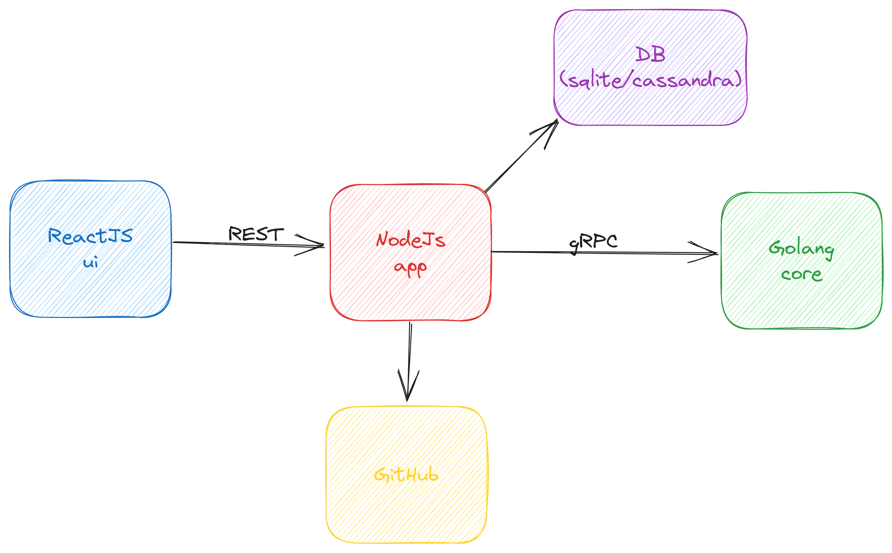

# Contribution Guidelines
Please read this guide if you plan to contribute to the Compage. We welcome any kind of contribution. No matter if you are an experienced programmer or just starting, we are looking forward to your contribution.

## Reporting Issues
If you find a bug while working with the Compage, please [open an issue on GitHub](https://github.com/intelops/compage/issues/new?labels=kind%2Fbug&template=bug-report.md&title=Bug:) and let us know what went wrong. We will try to fix it as quickly as we can.

## Feature Requests
You are more than welcome to open issues in this project to [suggest new features](https://github.com/intelops/compage/issues/new?labels=kind%2Ffeature&template=feature-request.md&title=Feature%20Request:).

## Contributing Code
This project is written in Golang, Node.js(TypeScript) and ReactJs(TypeScript). 


To contribute code.
1. Ensure you are running golang version 1.11.4 or greater for go module support
2. Set the following environment variables:
    ```
    GO111MODULE=on
    GOFLAGS=-mod=vendor
    ```
3. Ensure you have Node.js(LTS >= v18.18.0) installed for app and ui part of the compage.
   #### KinD
   - Install KinD from https://kind.sigs.k8s.io/docs/user/quick-start/#installing-from-release-binaries
   - Create KinD cluster using below command
     ```shell
     cd deploy
     ./create-kind-cluster.sh
     ```
   - Check if you can access the cluster created in previous step, and you are able to list down the pods.
4. Fork the project.
5. Clone the project: `git clone https://github.com/[YOUR_USERNAME]/compage && cd compage`
6. kindly refer compage.md file to know the structure of the project.
7. The Compage has three servers (subprojects) which need to be started to run the compage on local
   - (Golang), navigate to core directory and follow its [core README](./core/README.md)
8. Commit changes *([Please refer the commit message conventions](https://www.conventionalcommits.org/en/v1.0.0/))*
9. Push commits.
10. Open pull request.

## Regenerate the gRPC code from .proto files
- Install below packages in order to regenerate the gRPC code.
   ```shell
   go install google.golang.org/protobuf/cmd/protoc-gen-go@v1.28
   go install google.golang.org/grpc/cmd/protoc-gen-go-grpc@v1.2
   ``` 
- Update below statement in ~/.zshrc or ~/.bashrc depending on the shell you are using.
   ```shell
  export PATH="$PATH:$(go env GOPATH)/bin"
   ```
- Download buf binary from this link—https://github.com/bufbuild/buf/releases and fire the command from root directory of compage.
   ```shell
   buf generate
   ```
## How are DB(sqlite/cassandra) and GitHub interacted with above three components?
